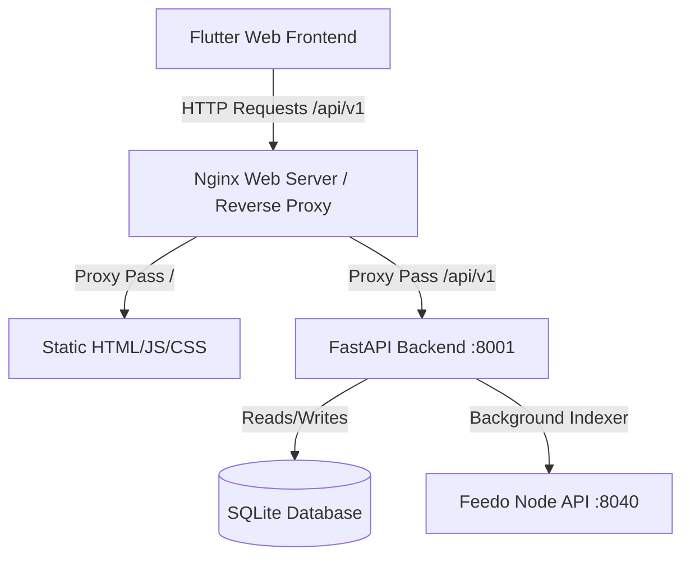

# Feedo Explorer

Feedo Explorer — це веб-панель (explorer) та супутній backend-індексатор для моніторингу стану децентралізованого протоколу Feedo. Проект складається з двох ізольованих частин:
1. **Frontend**: Клієнтський додаток на Flutter Web, який компілюється у статичні файли (HTML/JS/CSS) і хоститься через веб-сервер (наприклад, Nginx).
2. **Backend**: FastAPI-додаток на Python, який запускає фоновий індексатор (для періодичного стягування інформації з локальної ноди Feedo) та надає API-ендпоінти для фронтенду.

---

## 🛠 Архітектура та взаємодія



* **Frontend** звертається за відносним шляхом `/api/v1` до бекенду.
* **FastAPI Backend** зберігає кешовані дані (інформацію про ідентичності, консенсус-логи, ноди) у базі даних SQLite (`explorer.db`).
* **Фоновий індексатор** періодично звертається до головної ноди Feedo через `NODE_API_URL` для оновлення локального стану.

---

## 💻 Локальний запуск (Development)

### 1. Запуск Backend
Перейдіть до папки бекенду та налаштуйте середовище:
```bash
cd feedo_explorer/backend

# Створення віртуального середовища
python3 -m venv venv
source venv/bin/activate

# Встановлення залежностей
pip install -r requirements.txt

# Запуск FastAPI сервера разом із індексатором
uvicorn main:app --host 127.0.0.1 --port 8001 --reload
```

* Документація API буде доступна за адресою: `http://127.0.0.1:8001/docs`
* Змінні середовища:
  * `DATABASE_URL`: URL підключення до бази даних (дефолт: `sqlite:///./data/explorer.db`)
  * `NODE_API_URL`: Ендпоінт ноди Feedo для індексації (дефолт: `http://feedo_node:8040/api/v1`)

### 2. Запуск Frontend (Flutter)
Переконайтеся, що встановлено Flutter SDK (рекомендовано `>= 3.4.0`):
```bash
cd feedo_explorer

# Оновлення залежностей
flutter pub get

# Запуск у браузері Chrome
flutter run -d chrome
```

---

## 🚀 Продакшн деплой (Production)

Для максимальної продуктивності та безпеки фронтенд і бекенд деплояться окремо.

### 1. Збірка та деплой Backend (Docker)
Бекенд пакується в Docker-образ та запускається на сервері:

```bash
# 1. Збірка образу (виконувати з кореня проекту feedo!)
docker build -t itsshas/feedo-explorer:latest ./feedo_explorer/backend

# 2. Пуш образу в Docker Hub
docker push itsshas/feedo-explorer:latest
```

На сервері використовуйте `docker-compose.explorer.prod.yml` для запуску контейнера:
```bash
docker compose -f docker-compose.explorer.prod.yml up -d
```
> [!IMPORTANT]
> Переконайтеся, що зовнішня мережа (`networks.feedo_network.name`), яка вказана у файлі `docker-compose.explorer.prod.yml`, збігається з мережею вашої ноди Feedo (наприклад, `feedmedia_default` або `feedo_default`). Список мереж можна дізнатися через `docker network ls`.

### 2. Збірка та деплой Frontend (Static Web)
Зберіть статику для Flutter Web:
```bash
cd feedo_explorer

# Збірка веб-версії
flutter build web --release
```

Результат збірки буде знаходитися в папці `feedo_explorer/build/web`. Цю папку потрібно завантажити на ваш сервер (наприклад, в `/var/www/feedo-explorer`).

#### Приклад конфігурації Nginx
Налаштуйте Nginx для роздачі статики фронтенду та проксіювання запитів до бекенду:

```nginx
server {
    listen 80;
    server_name explorer.feedo.ink; # Ваше доменне ім'я

    # Роздача статичних файлів Flutter Web
    location / {
        root /var/www/feedo-explorer;
        index index.html;
        try_files $uri $uri/ /index.html;
    }

    # Проксіювання запитів до FastAPI Backend
    location /api/v1/ {
        proxy_pass http://127.0.0.1:8002/api/v1/;
        proxy_set_header Host $host;
        proxy_set_header X-Real-IP $remote_addr;
        proxy_set_header X-Forwarded-For $proxy_add_x_forwarded_for;
        proxy_set_header X-Forwarded-Proto $scheme;
    }
}
```
